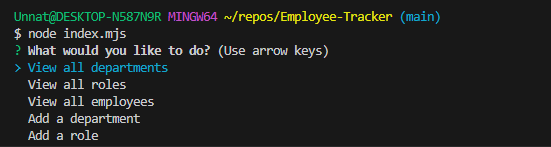

#  Employee tracker

## Project Description
An app to use a database to help a business owner keep track of HR informmation: departments, roles, and employees. There is functionality to query info about various topics and add in or update data within the database.

Preview video: 

### screenshot 

### github repository link

https://github.com/cdziedzic/employee-tracker

## Table of contents

- [Installation](#installation)
- [Usage](#usage)
- [License](#license)
- [Contributing](#contributing)
- [Tests](#tests)
- [Questions](#questions)

### Installation
enter node server.mjs into the terminal

### Usage 
For managing HR related information

### License

### Questions

[My github](github.com/cdziedzic)

E-mail: cdziedzic@gmail.com